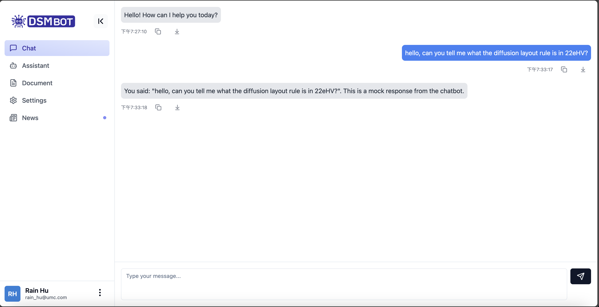

# DSM Bot

[video](./dsmbot-demo.mov)

# Tech Stacks
1. Backend: `C#.Net 8`
2. Frontend: `React` `typescript` with `tailwindcss`
3. vector DB: HNSW + LRU Cache with local storage
4. Embedded Model: `text-embedding-ada-002`
5. LLM: `chagpt-4o-for-text`
6. Data Ingestion: `pdfpig` + own-dev table extractor
7. Text Spliiter: custom semantic chunking

